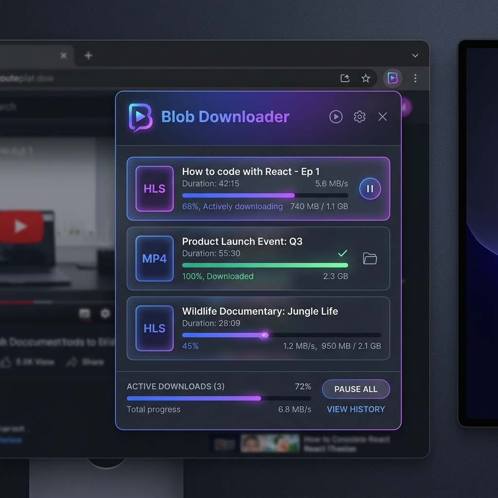
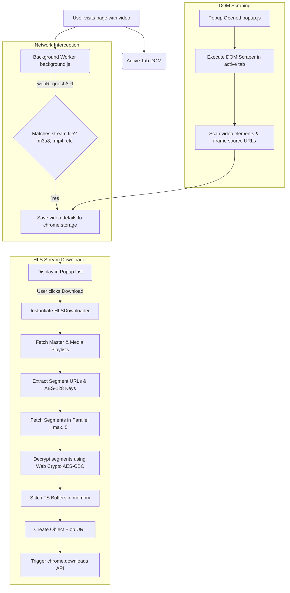

<div align="center">

<!-- Logo -->


# Blob Video Downloader

<h3>A high-performance, elegant, and secure browser extension to sniff and download video streams locally.</h3>

<!-- Badges -->
<p align="center">
  
  
  
  
  
</p>

<p align="center">
  <a href="#key-features">Key Features</a> •
  <a href="#how-it-works">How It Works</a> •
  <a href="#installation">Installation</a> •
  <a href="#usage">Usage</a> •
  <a href="#architecture">Architecture</a> •
  <a href="#technology-stack">Technology Stack</a>
</p>

---

</div>

## 🎬 Introduction

**Blob Video Downloader** is a professional Chrome Extension designed to sniff, capture, decrypt, and download video files (such as HLS streams, `.m3u8` playlists, MP4, and WebM format) directly inside your web browser. 

Unlike other online downloaders, **Blob Video Downloader** processes all stream segments locally on your machine. There are no external cloud servers, no bandwidth throttling, and no privacy compromises. It can download encrypted HLS video files on-the-fly and seamlessly merge them into a single high-quality media file.

---

## 📸 Preview

Here is a preview of the extension UI in action, featuring a glassmorphic dark interface with real-time download tracking:

<div align="center">
  
</div>

---

## 🚀 Key Features

* **⚡ Native HLS Stream Downloader**: Directly parses master/media `.m3u8` playlists, downloads `.ts` segments in parallel, and merges them.
* **🔒 AES-128 Decryption Support**: Automatic decryption of HLS segments using the Web Crypto API, pulling key tokens directly from your session.
* **🔍 Hybrid Detection System**:
  * **Network Sniffing**: Uses Chrome's `webRequest` API to capture streams loaded in the background dynamically.
  * **DOM Scraping**: Scans video elements and anchor tags, including nested `<iframe>` configurations.
* **📂 Concurrency Control**: Downloads multiple segments in parallel (5 concurrent threads) with simple recovery/retry mechanisms.
* **🎨 Premium Interface**: Styled with a dark glassmorphic layout, using custom CSS, micro-interactions, responsive progress bars, and cancel operations.
* **🛡️ Privacy-First & Zero Server Load**: 100% client-side compilation. Your download details and video streams never leave your device.

---

## 🛠️ Installation

Because this is a developer extension, you can load it directly into your Chromium-based browser:

1. **Clone or Download the Repository**:
   ```bash
   git clone https://github.com/yourusername/blob-vids-downloader.git
   ```
   *(Or download the zip file and extract it to a directory).*

2. **Open Extensions Page**:
   Open Google Chrome (or Microsoft Edge, Brave, Opera) and navigate to:
   ```text
   chrome://extensions/
   ```

3. **Enable Developer Mode**:
   Toggle the **Developer mode** switch in the top-right corner of the page.

4. **Load the Extension**:
   * Click the **Load unpacked** button in the top-left corner.
   * Select the root directory containing this project (`blob-vids-downloader`).

5. **Pin for Easy Access**:
   Click the puzzle piece icon on your Chrome toolbar, find **Blob Video Downloader**, and pin it.

---

## 📖 Usage

Using Blob Video Downloader is incredibly straightforward:

1. **Navigate** to any web page containing a video you wish to download (e.g., streaming sites, video hosting platforms).
2. **Play the video** briefly to trigger network requests.
3. Click the **Blob Downloader icon** in your toolbar.
4. A list of detected streams will appear inside the popup with badges specifying their types (`HLS Stream`, `MP4`, `WEBM`).
5. Click **Download Video** on your target stream.
   * *For standard videos*: It downloads instantly using Chrome's native downloader.
   * *For HLS streams*: A progress bar appears directly in the popup, detailing the progress. Once completed, it compiles and prompts you to save the resulting `.ts` file.
6. Click the trash icon in the header if you want to clear the list of sniffed videos.

---

## 🏗️ Architecture

The flow diagram below explains how background sniffing, DOM scraping, and local compilation connect to download video files safely:



---

## 📂 File Directory Structure

```text
blob-vids-downloader/
│
├── assets/                    # Graphical resources
│   └── extension_preview.png  # Generated screenshot banner
│
├── background.js              # Service worker intercepting network traffic
├── manifest.json              # Extension metadata and Manifest V3 details
├── popup.html                 # Visual layout of the dropdown extension panel
├── popup.css                  # Modern Outfit typography and glassmorphic styles
├── popup.js                   # Application controller, DOM scraper, and HLSDownloader
│
├── icon.svg                   # Vector source logo (indigo/purple play-down gradient)
├── icon16.png                 # Toolbar icon (16x16)
├── icon48.png                 # Extension dashboard icon (48x48)
├── icon128.png                # Chrome Web Store asset (128x128)
└── resize_icon.py             # Script to generate sizes automatically from SVG
```

---

## 🛡️ Technical Specifications

### Concurrency and Abort Processing
The extension implements a sliding worker queue for stream segments:
```javascript
const concurrency = 5;
const queue = [...Array(segments.length).keys()];
// Worker threads pull indexes from the queue concurrently
```
If you decide to stop downloading mid-process, the **Cancel** button immediately executes abort signals via the `AbortController` API, freeing socket connections and memory:
```javascript
cancel() {
  this.isCancelled = true;
  for (const controller of this.activeFetches) {
    controller.abort();
  }
}
```

### AES-128 Decryption
The segment decryption leverages the fast, hardware-accelerated Web Crypto API:
```javascript
const cryptoKey = await crypto.subtle.importKey(
  "raw",
  keyInfo.keyBuffer,
  { name: "AES-CBC" },
  false,
  ["decrypt"]
);
```

---

## 📄 License

This project is licensed under the MIT License. Feel free to modify and distribute it as needed.

---

<div align="center">
  Made with ❤️ by a developer who loves clean code.
</div>
